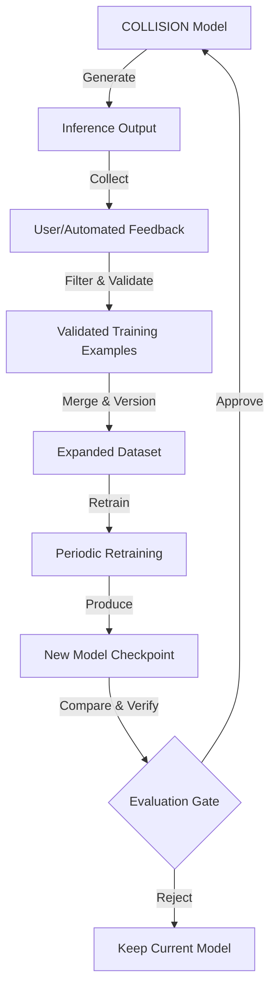

# COLLISION Future Self-Learning Architecture

This directory outlines the theoretical design and safety constraints for a future self-learning iteration of the COLLISION language model family.

## 1. Conceptual Self-Learning Loop

## 2. Planned Components

- **Feedback Collection**: APIs or interfaces to capture user corrections, ratings, or programmatic syntax validation.
- **Dataset Expansion**: Automated ingestion pipelines that convert high-quality outputs into training formats.
- **Automatic Evaluation**: Running perplexity checks and benchmark test suites on new checkpoints.
- **Human Validation**: An approval dashboard for reviewing new training data before merging.
- **Dataset Versioning**: Tracking dataset snapshots (e.g., v1.0, v1.1) to allow rollbacks and ensure reproducible training.
- **Periodic Retraining**: Cron-like background tasks that kick off retraining loops when new data thresholds are met.
- **Model Comparison**: Side-by-side generation checks comparing older checkpoints against newer ones.

---

## 3. Safety Guidelines & Guardrails

> [!CAUTION]
> **Safety Against Corrupted Weights and Poisoning**
> To prevent models from degrading, becoming unstable, or suffering from adversarial poisoning, the following rules must be enforced.

### Weight Modifications
- **No Weight Modifications During Inference**: The model weights must remain static during inference. Online updates or real-time weight adjustments on raw inputs are strictly prohibited.
- **Offline Retraining Only**: All learning must occur offline through controlled, batch training steps on verified data.

### Data Validation
- **Never Blindly Train on Every User Interaction**: Raw user prompts and generated model outputs can contain garbage, spam, or toxic content. All interaction logs must pass quality filters (e.g., length, repetitive sequences, syntax correctness) before being queued for dataset incorporation.
- **Human Approval Gate**: A human-in-the-loop validation process must approve batches of new samples before they are merged into the golden dataset.

### Evaluation and Deployment Gates
- **Never Automatically Replace the Best Model Without Evaluation**: Newly trained checkpoints must undergo comprehensive regression testing and evaluation.
- **The Golden Checkpoint Rule**: If the validation loss or perplexity of a new checkpoint is worse than the current baseline, the new checkpoint must be rejected.
